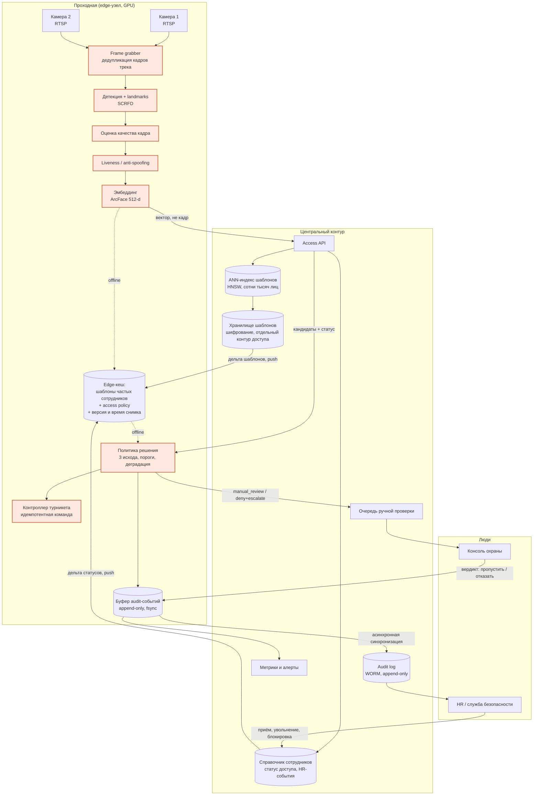
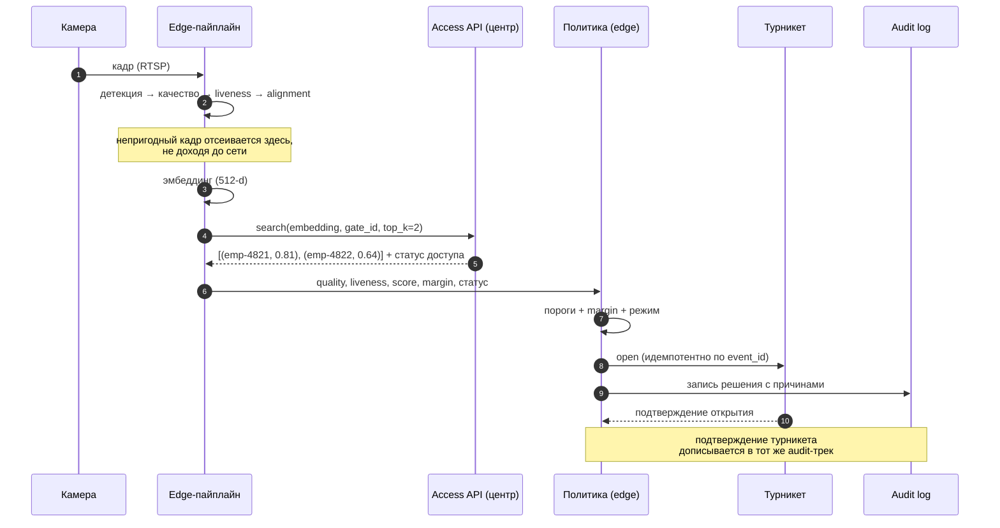
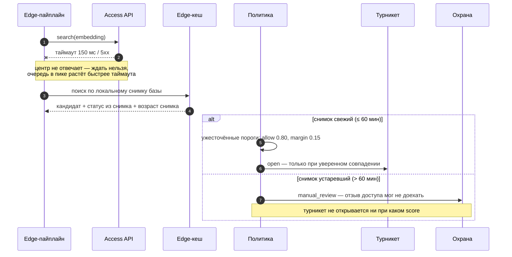
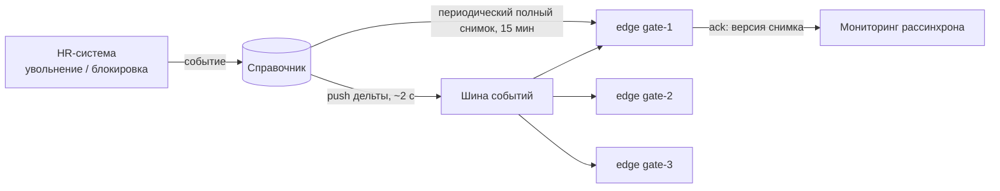

# Целевая архитектура

## 1. Главное решение: гибрид, а не «всё на edge» и не «всё в центре»

Требование — уложиться в 1 секунду от кадра до команды турникету (p95) и при этом
корректно деградировать при потере сети. Эти два требования тянут в разные стороны,
и граница проходит по типу данных, а не по типу вычислений.

| Что | Где выполняется | Почему именно там |
|---|---|---|
| Захват кадра, детекция, качество, alignment, liveness | **edge** | Кадр не должен покидать проходную. Отправлять изображение в центр — это лишние 100–300 мс и постоянный поток биометрии по сети |
| Извлечение эмбеддинга | **edge** | Наружу уходит вектор, а не лицо. Кадр удаляется сразу после обработки |
| Поиск one-to-many по базе | **центр** (с горячим кешем на edge) | Индекс на сотни тысяч лиц и его перестроение — это центральная операция. Держать полную базу на каждой из трёх проходных дорого и опасно |
| Решение allow/manual_review/deny | **edge** | Решение обязано приниматься даже без сети. Политика — это код и пороги, они реплицируются легко |
| Audit log | **edge (буфер) → центр (WORM)** | Запись не имеет права потеряться при обрыве сети; синхронизация асинхронная |
| Обучение, перестроение индекса, аналитика | **центр** | Не на горячем пути вообще |

Ключевое следствие: **центральный сервис не находится на критическом пути открытия
турникета**. Он нужен для свежести данных, а не для работоспособности. При его
недоступности проходная продолжает работать в ужесточённом режиме.

## 2. Компоненты и потоки данных

Красным выделен **синхронный горячий путь**. Всё остальное — асинхронно и не блокирует
турникет.

## 3. Горячий путь: happy path

### Бюджет задержки (p95, ориентир 1000 мс)

| Этап | Бюджет |
|---|---|
| Захват кадра и выбор лучшего кадра трека | 40 мс |
| Детекция + landmarks (SCRFD, TensorRT FP16) | 15 мс |
| Оценка качества | 5 мс |
| Alignment + liveness | 25 мс |
| Эмбеддинг (ArcFace 512-d) | 25 мс |
| Сетевой round-trip до Access API | 30 мс |
| ANN-поиск (HNSW, efSearch=64, 500k шаблонов) | 15 мс |
| Политика + запись в буфер audit | 10 мс |
| Команда турникету и подтверждение | 40 мс |
| **Итого ожидаемое** | **≈ 205 мс** |
| Запас на ретрай, GC, всплеск нагрузки | ≈ 795 мс |

Запас взят намеренно большой: пиковая нагрузка 20 проходов в минуту на проходную —
это 0.33 RPS, то есть система не упирается в пропускную способность, она упирается
в хвост распределения. Именно поэтому бюджет расписан по p95, а не по среднему.

## 4. Деградация: что происходит, когда что-то отвалилось

| Отказ | Поведение | Почему так |
|---|---|---|
| Пропала сеть до центра | Работа по edge-кешу с ужесточёнными порогами | Проходная не имеет права встать целиком |
| Кеш устарел (> 60 мин) | Только `manual_review`, автооткрытия нет | Отзыв доступа мог не доехать — это единственная ошибка, которую нельзя откатить |
| Недоступна модель (краш инференса) | Полный откат на карту-пропуск, лицо не проверяется | Лучше вернуться к прежнему UX, чем городить недоверенный путь |
| Недоступен турникет | Решение пишется в audit, охрана открывает вручную | Решение и исполнение разделены |
| Камера деградировала (грязь, засветка) | Рост доли `quality_below_threshold` → алерт, откат проходной в режим карты | См. [monitoring.md](monitoring.md) |
| Переполнен буфер audit | Проходная переходит в режим карты | Решение без записи в audit недопустимо |

**Правило, из которого выведено всё остальное: деградация никогда не расширяет права.**
Любой отказ двигает систему в сторону «строже», а не «свободнее».

## 5. Идемпотентность и защита от двойного открытия

Проблема реальна: камера отдаёт несколько кадров одного человека, сеть ретраит запрос,
edge-узел может перезапуститься между решением и командой.

Решение в трёх слоях, все реализованы в PoC:

1. **Ключ идемпотентности — `event_id`.** `decision_id` и `audit_id` детерминированно
   выводятся из него (`uuid5`), поэтому ретрай даёт те же идентификаторы.
2. **Audit log — источник истины для дедупликации.** Перед обработкой сервис ищет
   `event_id` в логе; найденное решение возвращается с командой `noop`. Индекс
   восстанавливается из лога при старте, поэтому перезапуск узла ничего не ломает
   (тест `test_idempotency_survives_service_restart`).
3. **Дедупликация трека на уровне frame grabber.** Несколько кадров одного человека
   в пределах окна ~2 с схлопываются в одно событие ещё до инференса — это экономит
   GPU и убирает основную массу дублей.

Команда турникету идемпотентна и на своей стороне: контроллер принимает
`(decision_id, command)` и игнорирует повтор с тем же `decision_id`.

## 6. Хранилища

| Хранилище | Что лежит | Срок | Доступ |
|---|---|---|---|
| Справочник сотрудников | employee_id, статус доступа, привязка к площадке | пока работает + срок кадрового архива | HR-система, сервис доступа |
| Хранилище шаблонов | эмбеддинги, версия модели, дата энролмента | пока действует согласие; удаление в течение 24 ч после увольнения | отдельный контур, доступ по запросу с логированием |
| ANN-индекс | копия шаблонов в структуре HNSW | перестроение по расписанию + инкрементальные вставки | сервис доступа |
| Audit log | решения, причины, оценки, версия политики — **без биометрии** | 1 год (срок задать вместе с ИБ) | WORM, служба безопасности |
| Кадры | **не хранятся**; исключение — кадр спорного события | 15 минут, только по ссылке с TTL, только для карточки охраны | охрана, в момент разбора |
| Edge-кеш | подмножество шаблонов + access policy + время снимка | до следующей синхронизации | только edge-узел, шифрование на диске |

Кадр — самый чувствительный артефакт, поэтому он живёт кратчайшее время и никогда не
попадает в audit log. Подробнее — [risks-and-ops.md](risks-and-ops.md).

## 7. Обновление базы и скорость отзыва доступа

Два независимых канала: **push дельт** для скорости и **периодический полный снимок**
для сходимости. Push может потеряться, снимок — нет.

* Целевое время доставки отзыва доступа: **до 5 секунд** при живой сети.
* Гарантированное: **до 15 минут** (интервал полного снимка).
* Если edge не подтвердил версию снимка дольше 60 минут — проходная сама переходит в
  режим `manual_review` для всех событий. Это тот же порог, что и `stale_cache` в PoC.

Отдельно: отзыв доступа — это операция «запретить», и она обязана применяться
оптимистично. Если edge не уверен в свежести — он запрещает, а не разрешает.

## 8. Интерфейс охраны

Карточка в очереди ручной проверки содержит: кадр (по ссылке с TTL 15 минут), причину
попадания в очередь на человеческом языке, кандидата с оценкой и отрывом от второго,
кнопки «пропустить» и «отказать». SLA — 60 секунд на решение в пике.

Важно: вердикт охраны пишется в тот же audit-трек и становится **delayed label** для
оценки качества модели (см. [ml.md](ml.md#8-delayed-labels)). Это единственный источник
настоящей разметки в проде, поэтому интерфейс проектируется как инструмент сбора
данных, а не только как кнопка.

## 9. MVP против целевой архитектуры

| Возможность | MVP (пилот на одной проходной) | Целевая |
|---|---|---|
| Инференс | edge, одна модель детекции + ArcFace | + ансамбль liveness, IR-канал |
| Индекс | плоский индекс в памяти на 12 000 шаблонов | HNSW, сотни тысяч, несколько площадок |
| Режим | shadow → ассистирующий | полная замена карты |
| Liveness | пассивный 2D | пассивный 2D + IR + челлендж для спорных |
| Кеш на edge | полный снимок (12 000 шаблонов — это мегабайты) | подмножество по площадке |
| Ручная проверка | веб-карточка | интеграция в рабочее место охраны |
| Tailgating | только детект «несколько лиц в кадре» | трекинг по видео + датчик турникета |

12 000 сотрудников × 512 float16 = **12 МБ** шаблонов. Это принципиально: на пилоте
полный кеш помещается на edge целиком, и вся сложность с подмножествами появляется
только при масштабировании на сотни тысяч лиц.
