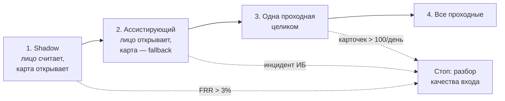

# Продуктовый дизайн

## 1. Проблема, сегменты и ценность

### Чью боль решаем в первую очередь

Первым делом решается боль **сотрудника в утреннем пике**. Там сосредоточены деньги:
время в очереди стоит компании около **15.8 млн ₽ в год** (раздел 4), тогда как весь
ручной разбор у охраны — около 1.2 млн ₽. Разница в тринадцать раз, и она определяет
приоритеты: оптимизировать надо очередь, а не количество разборов, хотя разборы заметнее
и раздражают громче.

Вторая боль — **дыра, которую карта не закрывает в принципе**: её можно передать коллеге,
и система об этом не узнает. Это не про скорость, это про то, что нынешний контроль
доступа не выполняет свою основную функцию.

### Сегменты и что каждому важно

| Сегмент | Размер | Что для него успех | Чем рискует |
|---|---|---|---|
| Сотрудник в пике | ~4 300 проходов/день | не стоять в очереди | ложный отказ на глазах у очереди |
| Сотрудник вне пика | ~14 700 проходов/день | не доставать карту | то же, но без свидетелей |
| Охрана | 3 поста × 2 смены | меньше рутины, понятные карточки | вал ручных проверок вместо разгрузки |
| Служба эксплуатации | заказчик | предсказуемость, меньше заявок | новая инфраструктура на поддержке |
| ИБ | стейкхолдер с правом вето | доказуемый контроль доступа | биометрия как новый объект защиты |

Ключевое различие: сотруднику важно **не быть отвергнутым**, охране — **не утонуть в
карточках**, ИБ — **не пропустить чужого**. Это три разные ошибки, и они конфликтуют:
снижая одну, повышаешь другую. Весь дизайн порогов — управление именно этим конфликтом.

### Ценностное предложение

**Сотруднику:** «Ты просто идёшь, и турникет открывается. Не надо доставать карту, не
надо помнить, где ты её оставил, и не надо стоять двадцать минут, потому что кто-то
впереди роется в сумке».

**Охране:** «Ты перестаёшь быть живым обходным путём системы. Вместо сорока разборов
"забыл пропуск" по четыре минуты — короткие карточки, где уже видно, кто это, насколько
система уверена и почему засомневалась».

**Бизнесу:** «Проход перестаёт быть узким местом рабочего дня и перестаёт быть
контролируемым только на бумаге: каждое решение о доступе воспроизводимо, объяснимо,
лежит в audit log, а передача пропуска коллеге больше не работает».

Разница по сути: сотруднику продаётся **время и отсутствие трения**, охране — **уход от
роли ручного обходного пути**, бизнесу — **управляемость и доказуемость контроля**.

## 2. Бэклог продуктовых гипотез

Приоритет считается как `(Эффект × Охват × Уверенность) / Стоимость проверки`, где
эффект и охват — вклад в North Star по шкале 1–5, уверенность — насколько мы уже верим
в гипотезу (1–5), стоимость проверки — в человеко-неделях. Риск учитывается отдельно,
как ограничение, а не как множитель: гипотеза с высоким риском не отбрасывается, но
проверяется в режиме, где риск не может реализоваться.

| # | Гипотеза | Эффект | Охват | Увер. | Стоим. | Балл | Риск | Приоритет |
|---|---|---|---|---|---|---|---|---|
| **H5** | **Аналитика очередей, балансировка потока между проходными** | 3 | 3 | 4 | **2 н.** | **18.0** | низкий | **1 (по времени)** |
| **H1** | **Проход по лицу вместо карты** | 5 | 5 | 3 | **10 н.** | **7.5** | высокий | **1 (по важности)** |
| H7 | Детект передачи карты (сверка лица и карты в shadow) | 3 | 5 | 4 | 1 н.* | 60.0* | низкий | входит в H1 |
| H2 | Безбумажный разовый пропуск для забывших карту | 2 | 2 | 4 | 3 н. | 5.3 | средний | 3 |
| H6 | Гибридный 1:1 режим для тех, кому лицо стабильно отказывает | 2 | 1 | 5 | 2 н. | 5.0 | низкий | 4 |
| H4 | Детект прохода «паровозиком» (tailgating) | 3 | 5 | 2 | 8 н. | 3.8 | средний | 5 |
| H3 | Гостевой доступ с предрегистрацией | 1 | 1 | 3 | 4 н. | 0.8 | средний | 6 |

\* H7 формально лидирует по баллу, но её стоимость близка к нулю только потому, что она
целиком помещается внутрь shadow-этапа H1. Отдельным экспериментом она не проводится —
это было бы двойным счётом.

### Почему начинаем именно с H1 и H5

**H5 идёт первой по времени, хотя вторая по важности.** Она проверяется на уже
существующих логах карт, не трогает биометрию, не требует ни одного нового устройства и
даёт часть эффекта по главной статье расходов ещё до того, как первая камера заработает.
Это дешёвый способ снять неопределённость по самому дорогому допущению проекта: **правда
ли очередь сокращается, если ускорить проход**. Если окажется, что узкое место — не
скорость идентификации, а физическая пропускная способность дверей, экономическая модель
H1 рушится целиком. Узнать это за две недели и ноль рублей несопоставимо дешевле, чем за
десять недель и полмиллиона.

**H1 идёт первой по важности**, потому что она и есть продукт: только она закрывает обе
боли — время в пике и передачу пропуска. Остальные гипотезы либо надстройки над ней
(H2, H4, H6, H7), либо касаются потока, которым можно пренебречь (H3).

Формально по баллу H2 и H6 обходят H4, и это осознанно: H4 (tailgating) дороже и менее
изучена, но она единственная закрывает остаточный риск, который H1 создаёт сама —
распознанный сотрудник открывает турникет, а за ним проходит второй. Поэтому H4 не
опускается ниже пятого места, несмотря на балл.

### H1 — проход по лицу вместо карты

**Какое изменение и для кого.** Для всех 12 000 сотрудников: турникет открывается по
лицу, карта остаётся как fallback и не изымается. Сомнительные случаи уходят охране
карточкой с кандидатом и причиной, а не открывают турникет.

**Какого эффекта и на какую метрику.** North Star — доля проходов, закрытых
автоматически быстрее 5 секунд при нулевом числе подтверждённых mis-identification.
Цель на конец пилота: **≥ 85%** на одной проходной. Производная метрика — среднее
ожидание в утреннем пике: с 90 до ≤ 40 секунд.

**Как дёшево проверить.** Пилот на одной проходной, 10 недель, тремя ступенями:
2 недели shadow (лицо считает, карта открывает — риск ровно нулевой, зато собирается
честный FRR на реальных камерах), 4 недели ассистирующего режима на 200–300 добровольцах,
4 недели на всей проходной. Контроль — две другие проходные; метрики берутся из логов
турникетов, которые пишутся уже сегодня.

**Что признает гипотезу неверной.** Любое из трёх — стоп-сигнал:
1. FRR на shadow-этапе выше **3%** — это 570 отказов в день на кампус; продукт из
   ускорителя превращается в генератор очередей;
2. хотя бы **один подтверждённый mis-identification** — автооткрытие останавливается
   полностью до разбора причины;
3. среднее ожидание в пике на пилотной проходной **не улучшилось значимо** относительно
   контрольных — значит, узкое место не в скорости идентификации, и вся экономика H1
   построена на неверном допущении.

### H5 — аналитика очередей и балансировка потока

**Какое изменение и для кого.** Для сотрудников в утреннем пике: экран у входа в кампус
и push в корпоративном приложении показывают загрузку трёх проходных и рекомендуют менее
загруженную. Никакой биометрии, только счётчики турникетов.

**Какого эффекта и на какую метрику.** Метрика — коэффициент вариации числа проходов по
проходным за 5-минутное окно в пике и среднее ожидание. Ожидание: перераспределение
10–15% пикового потока, сокращение среднего ожидания на 15–20% без единого изменения в
железе.

**Как дёшево проверить.** Сначала ретро-анализ логов карт за три месяца — две недели
работы одного аналитика: видно ли вообще неравномерность и сколько людей теоретически
можно перенаправить. Если разброс есть — A/B на две недели: push-подсказки получает
случайная половина сотрудников.

**Что признает гипотезу неверной.** Если ретро-анализ покажет равномерную загрузку
(коэффициент вариации < 0.15) — перенаправлять некого, гипотеза мертва до эксперимента.
Если A/B покажет, что подсказки читают, но не следуют им (доля сменивших маршрут < 5%) —
гипотеза мертва как продукт, даже если разброс есть.

## 3. Метрики продукта

### North Star

**Доля проходов, закрытых автоматически быстрее 5 секунд, при нулевом числе
подтверждённых инцидентов безопасности.** Цель — **≥ 85%** к концу пилота.

Метрика составная намеренно: числитель растёт от ослабления порогов, но множитель
«ноль инцидентов» делает такое ослабление бессмысленным. Одной цифрой измеряются и
скорость, и безопасность, и разменять их друг на друга нельзя.

### Guardrail-метрики

| Метрика | Порог | Действие при пробитии |
|---|---|---|
| **FRR** — отказ действующему сотруднику | ≤ 1.0% (алерт с 0.7%) | Проходная автоматически возвращается в режим карты; разбор до восстановления |
| **Нагрузка на охрану** — карточек `manual_review` в день на проходную | ≤ 60 | Повышается `quality_min`, часть потока уходит на карту без эскалации; при > 100 — откат в shadow |
| **Подтверждённые инциденты безопасности** | **0** | Автооткрытие останавливается на всех проходных до конца расследования |
| **p95 latency** от кадра до команды турникету | ≤ 1000 мс | Откат проходной на карту; разбор бюджета задержки |
| **Доля проходов по карте при работающем лице** | ≤ 20% | Сигнал недоверия к продукту; исследование с сотрудниками, не техническая правка |

Последняя метрика добавлена намеренно: система может быть технически безупречной и при
этом отвергаться людьми. Если сотрудники продолжают доставать карту, имея работающее
лицо, продукт не состоялся — независимо от FRR.

## 4. Расчёт годового эффекта

### Допущения

| # | Допущение | Значение | Основание |
|---|---|---|---|
| A1 | Рабочих дней в году | 247 | производственный календарь |
| A2 | Проходов в утреннем пике | 22.5% (половина от 45%) = 4 275/день | вводные задания |
| A3 | Время прохода по лицу | 2 с против 6 с по карте | нет операции «достать карту» |
| A4 | Сокращение ожидания в пике | −60% (90 → 36 с) | пропускная способность растёт втрое, очередь нелинейна; взята консервативная оценка |
| A5 | **Цена одного false accept** | **500 000 ₽** | расследование ИБ (3 человека × 3 дня), пересмотр контура доступа, репутационный и регуляторный риск. Порядок — сотни тысяч: ниже 100 000 ₽ не бывает даже при пустом исходе, выше миллиона — только при реальной утечке |
| A6 | Разбор карточки `manual_review` | 30 с, ≈15 ₽ | охранник не отходит с поста, на карточке уже виден кандидат и причина. Стоимость минуты охраны — 30 ₽ (120 ₽ за 4 минуты из вводных) |
| A7 | Сопровождение системы | 0.5 FTE, 1.8 млн ₽/год | ML + инфраструктура |
| **A8** | **Доля сотрудников, давших согласие на биометрию** | **85%** | биометрия требует явного согласия; отказавшиеся остаются на карте. Допущение непроверенное и одно из самых рискованных |

### Экономика (базовый сценарий: adoption 85%, очередь −60%, FRR 1%)

| Статья | Расчёт | ₽/год |
|---|---|---|
| Экономия времени на самом проходе | 19 000 × 4 с × 247 × 10 ₽/мин × 0.85 | **+2 659 400** |
| Экономия ожидания в утреннем пике | 15 838 875 × 0.60 × 0.85 | **+8 077 800** |
| **Изменение нагрузки на охрану** | было 4 800 ₽/день; стало 1 200 + 161 отказ × 25 ₽ = 5 237 ₽/день | **−108 000** |
| Перевыпуск карт | 300 × 250 ₽ × 0.85 × 0.60 | **+38 250** |
| Ожидаемая цена ошибок при бюджете ≤ 2 mis-identification в год | 2 × 500 000 ₽ | **−1 000 000** |
| Capex, амортизация 3 года | 3 × (150 000 edge + 30 000 IR-камера) / 3 | −180 000 |
| Opex: центральный контур, хранилище, мониторинг | 40 000 ₽/мес | −480 000 |
| Сопровождение (A7) | 0.5 FTE | −1 800 000 |
| **Итого чистый эффект** | | **≈ +7.21 млн ₽/год** |

### Два вывода, которые меняют постановку задачи

**Первый: разгрузка охраны — это не выигрыш, а риск.** Сегодня охрана разбирает
40 случаев в день. При FRR 1% и adoption 85% система создаёт 161 отказ в день, и даже
при разборе по 30 секунд вместо четырёх минут нагрузка выходит **на 108 тысяч рублей в
год хуже нынешней**. Продукт, который продавался как «снимем с охраны рутину», в базовом
сценарии охрану не разгружает вовсе. Разгрузка начинается только с FRR ниже ≈0.7%.

Отсюда два следствия: карточка `manual_review` обязана разбираться за 30 секунд, иначе
экономика ломается ещё сильнее; и метрика «карточек в день» — не косметический
guardrail, а связывающее ограничение продукта.

**Второй: бюджет ошибки стоит дороже, чем кажется.** Изначально я закладывал допуск
в 5 mis-identification в год. При цене 500 000 ₽ за инцидент это 2.5 млн ₽ ожидаемых
потерь — треть всего эффекта. Экономически оправданный бюджет оказывается **не более
1–2 в год**, и это ужесточение требований к модели пришло из финансовой модели, а не
из ML-соображений. Соответствующее требование к порогам пересчитано в
[ml.md](ml.md#5-выбор-порогов-и-баланс-farfrr).

### Сценарный анализ

Все три сценария посчитаны одной формулой, скрипт проверки — в истории коммитов.

| Сценарий | Adoption | Очередь | FRR | Бюджет ошибок | Чистый эффект |
|---|---|---|---|---|---|
| Пессимистичный | 60% | −30% | 2.0% | 3/год | **≈ +0.28 млн ₽** |
| **Базовый** | **85%** | **−60%** | **1.0%** | **2/год** | **≈ +7.21 млн ₽** |
| Оптимистичный | 95% | −75% | 0.5% | 1/год | **≈ +11.67 млн ₽** |

В пессимистичном сценарии проект формально в плюсе, но 0.28 млн ₽ при вложениях
2.46 млн ₽ в год — это ноль в пределах погрешности допущений. Практический вывод:
**решение о полной раскатке нельзя принимать до тех пор, пока A4 и A8 не заменены
измерениями на пилоте.** Разброс между сценариями сорокакратный, и он определяется не
качеством модели, а двумя непроверенными числами.

### Чувствительность и точки безубыточности

| Параметр | Цена ошибки | Безубыточность |
|---|---|---|
| FRR | 1.00 млн ₽ за каждый п.п. | эффект обнуляется при **FRR ≈ 8.2%** |
| Adoption (A8) | 1.15 млн ₽ за каждые 10 п.п. | минус только при **adoption < 22.3%** |
| Сокращение очереди (A4) | 1.35 млн ₽ за каждые 10 п.п. | минус при **сокращении < 6.5%** |

Расстановка сил здесь важнее самих чисел. **A4 — единственный параметр, ошибка в котором
убивает проект целиком**: он даёт 75% эффекта, и если очередь сократится не на 60%, а на
5%, всё остальное не имеет значения. Adoption влияет на размер выигрыша, но почти не
влияет на его знак. FRR занимает промежуточное положение: он не убивает экономику, но
именно он определяет, разгружается охрана или нагружается.

Отсюда порядок проверки гипотез: **сначала H5, которая проверяет A4 за две недели и ноль
рублей**, и только потом H1. И отсюда же — почему нельзя ослаблять порог ради снижения
FRR: это разменивает 1.00 млн ₽ за пункт на риск в 500 000 ₽ за инцидент при неизвестной
вероятности. Правильный рычаг — качество входа: свет, ракурс камеры, повторный энролмент.

## 5. План раскатки и пилот

| Майлстоун | Длит. | Критерий перехода дальше |
|---|---|---|
| **M1. Shadow на одной проходной** | 2 нед. | Собран честный FRR на реальных камерах; FRR ≤ 3%; recall@1 ANN ≥ 0.999; p95 latency ≤ 1000 мс; согласие получено минимум у 200 человек |
| **M2. Ассистирующий режим, добровольцы** | 4 нед. | 200–300 человек; FRR ≤ 1.5%; карточек ≤ 60/день; ноль инцидентов; доля проходов по карте при работающем лице ≤ 30% |
| **M3. Одна проходная целиком** | 4 нед. | Все guardrail в норме 4 недели подряд; ожидание в пике улучшилось значимо против контрольных; adoption ≥ 70% |
| **M4. Все проходные** | 3 нед. | Раскатка по одной проходной в неделю с недельным наблюдением после каждой |

Итого **13 недель** до полной раскатки, при этом первые честные данные о FRR появляются
на второй неделе и стоят ноль риска.

### Работа с согласием — часть продукта, а не юридическая формальность

Допущение A8 (85% согласий) — второе по стоимости после A4, и его нельзя оставлять на
откуп юристам. Что делается: согласие собирается **до** M1, отдельным понятным экраном,
с явным объяснением, что хранится вектор, а не фотография, и что отказ ничего не меняет —
карта продолжает работать. Доля согласий измеряется как продуктовая метрика с первого
дня; если она ниже 60% на пилотной группе, это стоп-сигнал уровня FRR, потому что
экономика при adoption 55% уходит в минус.

### Состав команды

| Роль | FTE | Зона ответственности |
|---|---|---|
| CV/ML-инженер | 1.0 | модели, пороги, валидация, подгруппы, delayed labels |
| Backend-инженер | 1.0 | Access API, индекс, справочник, audit log, очередь охраны |
| Edge / инфраструктура | 1.0 | edge-узлы, камеры, сеть, деградация, наблюдаемость |
| Информационная безопасность | 0.5 | модель угроз, доступ к шаблонам, audit, приёмка |
| Эксплуатация / охрана | 0.5 | процесс разбора карточек, обучение смены, обратная связь |
| Продукт | 0.5 | метрики, приоритизация, согласие и коммуникация с сотрудниками |

ИБ включена **с первого дня, а не на приёмке**: решения о сроках хранения и контуре
доступа определяют архитектуру, а не следуют за ней. Эксплуатация нужна так же рано,
потому что карточка охраны — не побочный интерфейс, а инструмент, от скорости которого
напрямую зависит знак экономического эффекта.

## 6. Что сознательно не делаем

| Не делаем | Почему |
|---|---|
| Не изымаем карты | Карта — единственный fallback и единственный дешёвый источник меток false reject |
| Не делаем распознавание обязательным | Биометрия по принуждению — это и юридический риск, и гарантированный конфликт |
| Не строим собственную модель распознавания | Готовые сильнее, а данных для обучения нет и быть не должно |
| Не автоматизируем окончательный отказ | Всегда остаются человек и карта, иначе система становится способом запереть сотрудника снаружи |
| Не открываем турникет при любом сомнении | Три исхода вместо двух — центральное решение всего дизайна |
| Не показываем сотруднику score и пороги | Это одновременно утечка чужих данных и подсказка атакующему |
