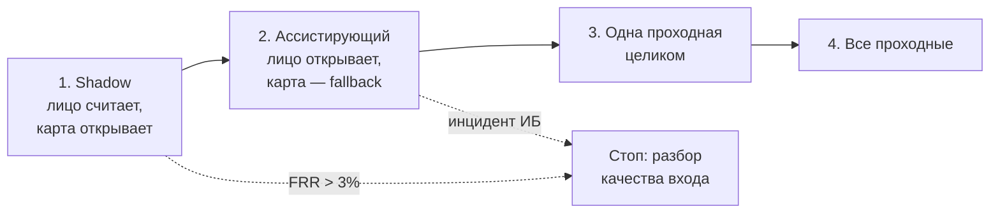

# Продуктовый дизайн

## 1. Проблема и чью боль решаем в первую очередь

Первым делом решается боль **сотрудника в утреннем пике**. Именно там сосредоточены
деньги: время в очереди стоит компании примерно **15.8 млн ₽ в год** (расчёт в разделе 4),
что на порядок больше стоимости ручных разборов у охраны. Всё остальное — производные
эффекты.

Вторая по важности боль — **дыра в контуре безопасности**, которую карта не закрывает
в принципе: карту можно передать коллеге, и система об этом не узнает. Это не про
скорость, это про то, что текущая система не решает свою основную задачу.

### Ценностное предложение — три разные ценности

**Сотруднику:** «Ты просто идёшь, и турникет открывается. Не надо доставать карту, не
надо помнить, где ты её оставил, и не надо стоять в очереди двадцать минут, потому что
кто-то впереди роется в сумке».

**Охране:** «Ты перестаёшь быть живым обходным путём системы. Вместо сорока разборов
«забыл пропуск» в день — короткая очередь карточек, где уже видно, кто это, насколько
система уверена и почему засомневалась; решение занимает секунды, а не четыре минуты».

**Бизнесу:** «Проход перестаёт быть узким местом рабочего дня и перестаёт быть
контролируемым только на бумаге: каждое решение о доступе воспроизводимо, объяснимо и
лежит в audit log, а передача пропуска коллеге больше не работает».

Разница по сути, а не по словам: сотруднику продаётся **время и отсутствие трения**,
охране — **уход от роли ручного обходного пути**, бизнесу — **управляемость и
доказуемость контроля доступа**.

## 2. Бэклог продуктовых гипотез

Оценки по шкале: эффект и охват — вклад в North Star; риск — вероятность навредить
безопасности или UX; стоимость проверки — сколько стоит узнать ответ.

| # | Гипотеза | Эффект | Охват | Риск | Стоимость проверки | Приоритет |
|---|---|---|---|---|---|---|
| **H1** | **Проход по лицу вместо карты** | **очень высокий** | 100% сотрудников | **высокий** (ошибка = инцидент ИБ) | высокая (пилот 8–10 недель) | **1** |
| **H5** | **Аналитика очередей и балансировка потока между проходными** | **высокий** | 45% проходов (пики) | **низкий** (ничего не блокирует) | **очень низкая** (2 недели на существующих логах карт) | **2** |
| H7 | Детект передачи карты: сверка лица и приложенной карты в shadow | средний | 100% | низкий (только наблюдение) | низкая (входит в shadow-этап H1) | 3 |
| H2 | Безбумажный разовый пропуск для забывших карту (self-service) | средний | ~40 случаев/день | средний | средняя | 4 |
| H4 | Детект прохода «паровозиком» (tailgating) | средний | все проходы | средний (ложные тревоги злят) | средняя | 5 |
| H6 | Гибридный 1:1 режим для тех, кому лицо стабильно отказывает | низкий по деньгам, высокий по справедливости | 1–3% сотрудников | низкий | низкая | 6 |
| H3 | Гостевой доступ с предрегистрацией | низкий | гости, вне основного потока | средний (внешние люди в базе биометрии) | средняя | 7 |

### Почему начинаем именно с H1 и H5

**H5 идёт первой по времени, хотя вторая по приоритету.** Она проверяется на уже
существующих логах карт, не трогает биометрию, не требует ни одного нового устройства
и даёт часть эффекта по главной статье расходов — очереди — ещё до того, как первая
камера начнёт распознавать лица. Это дешёвый способ снять неопределённость по самому
дорогому допущению всего проекта: **действительно ли очередь сокращается, если ускорить
проход**. Если окажется, что очередь упирается не в скорость турникета, а в физическую
пропускную способность дверей, то экономическая модель H1 рушится — и узнать это лучше
за две недели и ноль рублей, чем за десять недель и полмиллиона.

**H1 идёт первой по приоритету**, потому что она и есть продукт: только она закрывает
обе боли сразу — время в пике и передачу пропуска. Остальные гипотезы либо надстройки
над ней (H2, H4, H6, H7), либо касаются небольшого потока (H3).

H7 намеренно не выделена в отдельный эксперимент: она бесплатно получается на
shadow-этапе H1, где лицо распознаётся, а турникет открывает карта. Расхождение
«карта принадлежит A, лицо распознано как B» — это и есть измерение проблемы передачи
пропусков, и оно ничего не стоит сверх уже запланированного.

### H1 — проход по лицу вместо карты

**Какое изменение и для кого.** Для всех 12 000 сотрудников: на проходной турникет
открывается по лицу, карта остаётся как fallback и не изымается. Сомнительные случаи
уходят охране в виде карточки с кандидатом и причиной, а не открывают турникет.

**Какого эффекта и на какую метрику.** North Star — доля проходов, закрытых
автоматически быстрее 5 секунд при нулевом числе подтверждённых mis-identification.
Цель на конец пилота: **≥ 85%** на одной проходной. Производная метрика — среднее время
ожидания в утреннем пике: с 90 до ≤ 40 секунд.

**Как дёшево проверить.** Пилот на одной проходной, 8–10 недель, тремя ступенями:
2 недели shadow (лицо считает, карта открывает — риск ровно нулевой, зато собирается
честный FRR на реальных камерах), затем 4 недели ассистирующего режима на добровольцах
(200–300 человек), затем 4 недели на всей проходной. Сравнение — с двумя другими
проходными как контрольной группой, метрики берутся из логов турникетов, которые уже
пишутся сегодня.

**Что признает гипотезу неверной.** Любое из трёх, каждое — стоп-сигнал:
1. FRR на shadow-этапе выше **3%** — это 570 отказов в день на весь кампус, охрана
   такого не вывезет, и продукт из ускорителя превращается в генератор очередей;
2. хотя бы **один подтверждённый mis-identification** (сотрудник пропущен как другой
   сотрудник) за пилот — автооткрытие останавливается полностью до разбора;
3. среднее ожидание в пике на пилотной проходной не улучшилось значимо относительно
   контрольных — значит, узкое место не в скорости идентификации, и вся экономика H1
   построена на неверном допущении.

### H5 — аналитика очередей и балансировка потока

**Какое изменение и для кого.** Для сотрудников в утреннем пике: экран у входа в кампус
и push в корпоративном приложении показывают текущую загрузку трёх проходных и
рекомендуют менее загруженную. Никакой биометрии, только счётчики турникетов.

**Какого эффекта и на какую метрику.** Метрика — разброс загрузки между проходными в
пике (коэффициент вариации числа проходов за 5-минутное окно) и среднее ожидание.
Ожидание: перераспределение 10–15% потока пиковых проходов, сокращение среднего
ожидания на 15–20% без единого изменения в железе.

**Как дёшево проверить.** Сначала ретро-анализ на логах карт за три месяца, две недели
работы одного аналитика: видно ли вообще, что нагрузка неравномерна, и сколько людей
теоретически можно перенаправить. Если разброс есть — A/B на две недели: push-подсказки
получает случайная половина сотрудников, вторая половина контроль.

**Что признает гипотезу неверной.** Если ретро-анализ покажет, что загрузка проходных
равномерна (коэффициент вариации < 0.15) — перенаправлять некого, гипотеза мертва на
этапе анализа. Если A/B покажет, что подсказки получают, но не следуют им (доля
изменивших маршрут < 5%) — гипотеза мертва как продукт, даже если разброс есть.

## 3. Метрики продукта

### North Star

**Доля проходов, закрытых автоматически быстрее 5 секунд, при нулевом числе
подтверждённых инцидентов безопасности.** Целевое значение — **≥ 85%** к концу пилота.

Метрика составная намеренно: числитель растёт от ослабления порогов, но множитель
«ноль инцидентов» делает такое ослабление бессмысленным. Одной цифрой измеряется и
скорость, и безопасность, и их нельзя разменять друг на друга.

### Guardrail-метрики

| Метрика | Порог | Действие при пробитии |
|---|---|---|
| **FRR** — доля проходов, где лицо отказало действующему сотруднику | ≤ 1.0% (алерт с 0.7%) | Проходная автоматически возвращается в режим карты; разбор до восстановления |
| **Нагрузка на охрану** — карточек `manual_review` в день на проходную | ≤ 60 | Повышается `quality_min`, часть потока уходит на карту без эскалации; при > 100 — откат в shadow |
| **Подтверждённые инциденты безопасности** — mis-identification или прошедший spoof | **0** | Автооткрытие останавливается на всех проходных до завершения расследования |
| **p95 latency** от кадра до команды турникету | ≤ 1000 мс | Откат проходной на карту; разбор бюджета задержки |

Порог по нагрузке на охрану — не косметика, а **связывающее ограничение продукта**.
Показательный расчёт: при FRR 1% и 19 000 проходах в день система создаёт 190 карточек
в сутки на три проходные, тогда как сегодня охрана разбирает 40 случаев. Продукт,
который ускоряет проход и одновременно утраивает нагрузку на охрану, не решает исходную
задачу. Именно поэтому карточка `manual_review` проектируется под 30 секунд разбора,
а не под 4 минуты, как нынешний разбор забытого пропуска.

## 4. Расчёт годового эффекта MVP

### Допущения

| # | Допущение | Значение | Откуда |
|---|---|---|---|
| A1 | Рабочих дней в году | 247 | производственный календарь |
| A2 | Доля проходов в утреннем пике | 22.5% (половина от 45%) = 4 275/день | вводные задания |
| A3 | Время прохода по лицу | 2 с против 6 с по карте | оценка: нет операции «достать карту» |
| A4 | Сокращение ожидания в пике | −60% (90 с → 36 с) | пропускная способность растёт втрое, но очередь нелинейна; взята консервативная оценка |
| A5 | **Цена одного false accept** | **500 000 ₽** | расследование ИБ (3 человека × 3 дня), пересмотр контура доступа, репутационный и регуляторный риск. Порядок величины — сотни тысяч; ниже 100 000 ₽ не бывает даже при пустом исходе, выше миллиона — только при реальной утечке |
| A6 | Разбор карточки `manual_review` | 30 с, ≈15 ₽ | охранник не отходит с поста, на карточке уже видно кандидата и причину |
| A7 | Сопровождение системы | 0.5 FTE, 1.8 млн ₽/год | ML + инфраструктура |

### Экономика

| Статья | Расчёт | ₽/год |
|---|---|---|
| Экономия времени на самом проходе | 19 000 × 4 с × 247 × 10 ₽/мин | **+3 128 700** |
| Экономия ожидания в утреннем пике | 4 275 × 54 с × 247 × 10 ₽/мин | **+9 503 300** |
| Разгрузка охраны | было 40 × 120 ₽; стало 10 × 120 ₽ + 95 × 15 ₽ | **+537 200** |
| Перевыпуск карт (−60%, карта остаётся fallback) | 300 × 250 ₽ × 0.6 | **+45 000** |
| Capex, амортизация 3 года | 3 × (150 000 edge + 30 000 IR-камера) / 3 | −180 000 |
| Opex: центральный контур, хранилище, мониторинг | 40 000 ₽/мес | −480 000 |
| Сопровождение (A7) | 0.5 FTE | −1 800 000 |
| **Итого чистый эффект в год** | | **≈ +10.75 млн ₽** |

Полная стоимость времени в очереди — 15.8 млн ₽/год (4 275 × 90 с × 247 × 10 ₽/мин) —
и именно она делает проект окупаемым. Разбор у охраны, при всей его заметности, стоит
компании около 1.2 млн ₽/год, то есть в тринадцать раз меньше. Это меняет приоритеты:
оптимизировать надо очередь, а не количество разборов.

### Чувствительность к росту FRR

Каждый **дополнительный процентный пункт FRR** стоит примерно **1.17 млн ₽ в год**:
190 отказов в день × (30 с охранника + 60 с потерянного времени сотрудника). При
**FRR ≈ 9–10% весь эффект проекта обнуляется**, даже если проход стал вдвое быстрее.

Отсюда главный вывод экономики: **проект чувствителен не к качеству распознавания как
таковому, а к доле отказов**. Ослаблять порог ради снижения FRR нельзя — это разменивает
1.17 млн ₽ на риск в 500 000 ₽ за инцидент при неизвестной вероятности. Правильный
рычаг — качество входа: свет на проходной, ракурс камеры, повторный энролмент для тех,
у кого шаблон устарел.

## 5. План раскатки и пилот

| Майлстоун | Длительность | Критерий перехода дальше |
|---|---|---|
| **M1. Shadow на одной проходной** | 2 недели | Собран честный FRR на реальных камерах; FRR ≤ 3%; recall@1 ANN-индекса ≥ 0.999; p95 latency ≤ 1000 мс |
| **M2. Ассистирующий режим, добровольцы** | 4 недели | 200–300 человек; FRR ≤ 1.5%; карточек охране ≤ 60/день; ноль инцидентов; NPS добровольцев положительный |
| **M3. Одна проходная целиком** | 4 недели | Все guardrail в пределах порогов 4 недели подряд; среднее ожидание в пике улучшилось значимо против контрольных проходных |
| **M4. Все проходные** | 3 недели | Раскатка по одной проходной в неделю с недельным наблюдением после каждой |

Итого пилот — **13 недель** до полной раскатки, при этом первые честные данные о FRR
появляются на второй неделе и стоят ноль риска.

### Состав команды

| Роль | FTE | Зона ответственности |
|---|---|---|
| CV/ML-инженер | 1.0 | модели, пороги, валидация, подгруппы, delayed labels |
| Backend-инженер | 1.0 | Access API, индекс, справочник, audit log, очередь охраны |
| Edge / инфраструктура | 1.0 | edge-узлы, камеры, сеть, деградация, наблюдаемость |
| Информационная безопасность | 0.5 | модель угроз, доступ к шаблонам, audit, приёмка |
| Эксплуатация / охрана | 0.5 | процесс разбора карточек, обучение смены, обратная связь |
| Продукт | 0.5 | метрики, приоритизация гипотез, коммуникация с сотрудниками |

Роль ИБ включена **с первого дня, а не на приёмке**: биометрия — чувствительные данные,
и решения о сроках хранения и контуре доступа определяют архитектуру, а не следуют за
ней. Роль эксплуатации нужна так же рано, потому что карточка охраны — не побочный
интерфейс, а инструмент, от скорости которого напрямую зависит экономика (раздел 3).
